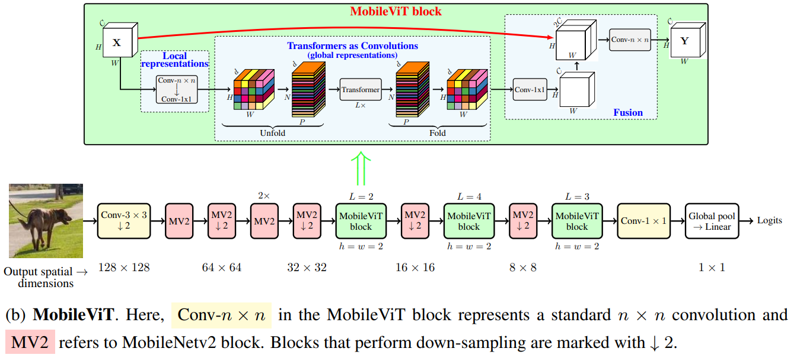

# MobileViT
MobileViT is a light-weight and general-purpose vision transformer for mobile vision tasks. It combines the strength of the standard CNN and the ViT. It has outperforms several CNNs and ViT-based network across different tasks and datasets.

## Architecture
|  |
| :--: |
| *The block diagram of the MobileViT along with the TMobileViT block.* |

## Contact:
For more follow me on:

- <a href="https://www.youtube.com/idiotdeveloper"> YouTube </a>
- <a href="https://facebook.com/idiotdeveloper"> Facebook </a>
- <a href="https://twitter.com/nikhilroxtomar"> Twitter </a>
- <a href="https://www.instagram.com/nikhilroxtomar"> Instagram </a>
- <a href="https://t.me/idiotdeveloper"> Telegram </a>
