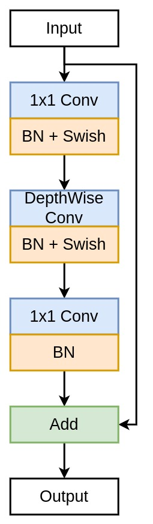
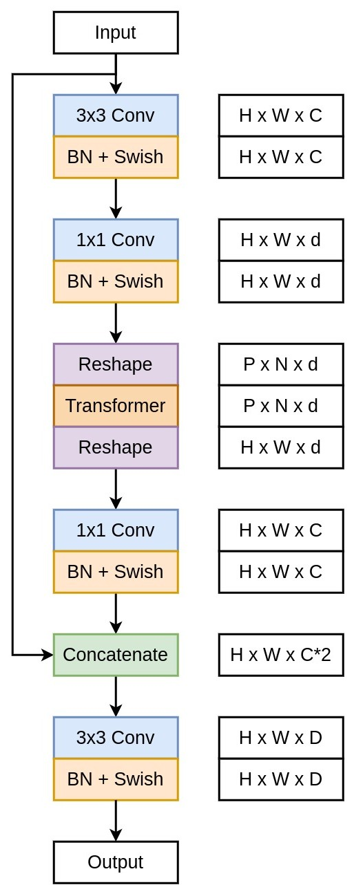

# ViT Implementation in TensorFlow
The repository contains the code for the implementation of MobileViT in TensorFlow.

## Inverted Residual Block
Inverted Residual Block block are mainly used for used for downsampling the feature maps by applying strided convolution.

## MobileViT Block
MobileViT block aims to model the local and global information in an input tensor with fewer parameters.

